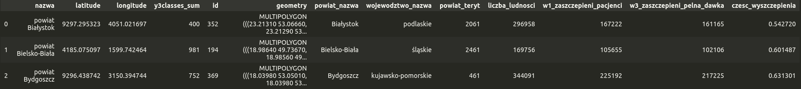

# Detekcja nastawienia polaków do szczepień przeciw Covid-19 na podstawie danych pozyskanych z Twittera

## Opis ogólny

Naszym głównym zbiorem danych jest zbiór Tweetów z projektu *#SzczepimySię - zwolennicy vs przeciwnicy* (z przedmiotu analiza mediów cyfrowych). Zbiór ten zawiera ~36.000 wpisów oraz interakcje użytkowników Twittera z okresu grudzień 2020 - grudzień 2021. Zbiór został przeanalizowany pod względem nastawienia polaków co do szczepionek przeciwko COVID-19, wraz z uzyskanymi danymi geograficznymi użytkowników. Do dalszych analiz postanowiliśmy dołączyć [zbiór](https://dane.gov.pl/pl/dataset/2476/resource/36006,raport-o-liczbie-mieszkancow-zaszczepionych-pierwsza-dawka-oraz-w-peni-zaszczepionych-w-miastach-powiatach-i-gminach-w-dniu-2022-01-23/table?page=1&per_page=20&q=&sort=) udostępniany przez projekt *Otwarte dane* rządu polskiego o statystykach wyszczepień przeciwko COVID-19 (stan na dzień 23.01.2022).

Postanowiliśmy sprawdzić czy istnieje korelacja między nastawieniem polaków co do szczepionek w powiatach oraz poziomem wyszczepienia w poszczególnych powiatach kraju. W tym celu użyliśmy metod regresji w danych przestrzennych poznanych na zajęciach. Wybraną podstawową jednostą korelacji w celu analizy postępu i opisu została miara R-kwadrat (pełne statystyki dostępne w notebooku).

## Dane - sposób pozyskania i ich wykorzystanie

### Pobieranie danych

Na potrzeby zrealizowania projektu *#SzczepimySię - zwolennicy vs przeciwnicy* pobieraliśmy dane z twittera przy pomocy 2 narzędzi:

- [stweet](https://github.com/markowanga/stweet)
- [tweepy - Twitter API](https://docs.tweepy.org/en/stable/)

Przy pomocy biblioteki [stweet](https://github.com/markowanga/stweet) pobieraliśmy tweety oraz informacje o użytkownikach, którzy je tweetują. Zawartość tematyczną tweetów pobieraliśmy na podstawie hashtagów występujących w danych tweetach. Możemy wyróżnić:

`hashtags_supporter = ['#szczepimysie', '#szczepimysię', '#szczepionka', '#OstatniaProsta']`
`hashtags_opponent = ['#Plandemia',  '#NieSzczepimySię', '#NieSzczepimySie', '#StopSegregacjiSanitarnej', '#RozliczymySanitarystow']`
`hashtags_general = ['#szczepionki', '#szpryca', '#nagle', '#zgony', '#depopulacja']`

Tweety były pobierane z okresu grudzień 2020 - grudzień 2021. W ten sposób udało się nam uzyskać ponad 36k tweetów napisanych przez blisko 9,5k użytkowników twittera.

Dane lokalizacyjne, które wykorzystaliśmy w ramach tego projektu pochodzą bezpośrednio od użytkowników. Żeby móc powiązać więcej więcej użytkowników z danym nastawieniem do szczepień postanowiliśmy przy pomocy biblioteki [tweepy](https://docs.tweepy.org/en/stable/) pobrać informacje, kto lajkuje tweety osób, które mają jakieś konkretne nastawienie do szczepień. Główna idea tego pomysłu jest taka, że jeśli 'ktoś' lajkuje tweeta osoby, która pisze o tym, że jest za szczepieniami to sama osoba lajkująca również jest za szczepieniami. Pomysł na wykorzystanie tej metody okazał się trafny, ponieważ udało się nam uzyskać ponad 155300 unikalnych nazw użytkowników, którym mogliśmy przyporządkować konkretne nastawienie.

Na podstawie uzyskanych nazw użytkowników ponownie skorzystaliśmy z biblioteki [stweet](https://github.com/markowanga/stweet), aby pobrać informacje o kontach tych użytkowników.

### Wydobywanie informacji geolokalizacyjnych

Każdy użytkownik twittera może (ale nie musi) podać swoje miejsce zamieszkania/życia/jakiekolwiek miejsce na ziemi. Podanie tej informacji jest dobrowolne i nie jest weryfikowane przez Twitter na poziomie jego wprowadzania. To powoduje, że dużo użytkowników albo nie podaje w ogóle informacji lokalizacyjnych albo podaje nazwy wymyślone.

W celu określenia dokładnych współrzędnych danych lokalizacji korzystaliśmy z geocodera opartego o dane z OpenStreetMaps, zaimplementowanego w bibliotece [geopy](https://geopy.readthedocs.io/en/stable/). Przy jego pomocy dla:

- 9500 użytkowników użytkowników tweetujących - uzyskaliśmy 2200 informacji o lokalizacji;
- 155300 użytkowników lajkujących tweety - uzyskaliśmy 22400 informacji o lokalizacjach.

Jeśli z tych danych weźmiemy tylko dane dotyczące polski to pozostanie nam 18640 współrzędnych lokalizacyjnych. To daje nam informacje, że tylko 15% użytkowników udziela realną informację o lokalizacji na Twitterze. W czym 11% tych użytkowników wskazuje tą lokalizacje w Polsce.

### Dodanie informacji o liczbie osób zaszczepionych

Chcą rozszerzyć naszą analizę dotyczącą nastawienia ludzi do szczepień postanowiliśmy dodać jeszcze informacje liczbie osób zaszczepionych oraz jaki procent populacji danego powiatu/województwa  jest zaszczepiony. W tym celu postanowiliśmy dołączyć [zbiór](https://dane.gov.pl/pl/dataset/2476/resource/36006,raport-o-liczbie-mieszkancow-zaszczepionych-pierwsza-dawka-oraz-w-peni-zaszczepionych-w-miastach-powiatach-i-gminach-w-dniu-2022-01-23/table?page=1&per_page=20&q=&sort=) udostępniany przez projekt *Otwarte dane* rządu polskiego o statystykach wyszczepień przeciwko COVID-19 (stan na dzień 23.01.2022).

### Agregazja danych przestrzennych

Dane dotyczące liczby zaszczepionych osób były zagregowane do powiatów oraz do województw. Żeby móc połaczyć te dane z naszymi danymi pochodzącymi z Twittera musieliśmy je również z agregować. W tym celu posłużyliśmy się informacjiami z repozytorium [polska-geojson](https://github.com/ppatrzyk/polska-geojson), w której znaleźliśmy dokłądne informacje o granicach każdego z województw jak i powiatów. Przy pomocy biblioteki [geopandas](https://geopandas.org/en/stable/) dokonaliśmy odpowiedniego rzutowania, co pozwoliło nam określić przynależność danych użytkowników do konkretnych województw jak i powiatów.

# Regresja

## Wyniki bazowe

Pierwszym krokiem było wykonanie regresji bez specjalnego uwzględniania danych geograficznych w celu uzyskania podstawowych metryk i mierzenia progresu. W tym oba zbiory zostały połączone, a następnie wyektrahowane zostały interesujące nas cechy. W celu ścisłości postanowiliśmy przebadać wyłącznie pełny poziom wyszczepienia. Zbiór danych na którym pracowaliśmy wyglądał następująco:

gdzie `y3classes_sum` to suma z pozytywnych i negatywnych użytkowników w danym powiecie, a `czesc_wyszczepienia` to informacja o odsetku wyszczepień danego powiatu. W celu przeprowadzeniu regresji zostały wybrane 3 cechy zbioru [`y3classes_sum`, `powiat_teryt`, `liczba_ludnosci`], a jako zmienną zależną wspomniana wcześniej `czesc_wyszczepienia`.

Po przeprowadzeniu podstawowej regresji używając modelu **OLS** związek między danymi wykazywał miarę R-squared na poziomie `0.1497`, w przypadku czego nie można mówić o występowaniu jakiejkolwiek zależności.

## Sprawdzenie zależności geograficznej

Następnym krokiem było przeprowadzenie testów, czy w danych zawierają się jakieś dodatkowe zależności geograficzne, które mogą zostać wykorzystane do uzyskania lepszego wnioskowania na zbiorze. W tym celu wyznaczyliśmy zależność między *residuals* modelu a ich *spacial lag* (używając algorytmu KNN z ilością sąsiadów ustawioną na `1`):

Na tym wykresie widzimy, że nasze błąd predykcji w badanym powiecie, a jego najbliżej sąsiadującym powiecie są dodatnie. To wskazuje na to, że nastawienie Polaków do szczepień w danym powiecie jest zależne od nastawienia Polaków w najbliżej położonym powiecie.

Następnie w celu wyznaczenia autokorelacji przestrzennej zwizualizowaliśmy również największych outlierów używając statystyki lokalnej Morana między modelem a algorytmem KNN dla ilości sąsiadów równej `20`:

To nam jednoznacznie ukazało, że w zbiorze można wyznaczyć lepszą korelację używając technik przestrzennych, gdyż wiele powiatów jest nadreprezentowanych lub niedoreprezentowanych przez obecny model.

## Testy zależności geograficznych

W ramach próby poprawy wyników regresji przetestowaliśmy kilka różnych metod włączenia zależności geograficznych do danych. Wszystkie testy były wykonywane niezależnie (każdy osobno w porównaniu do wersji bazowej).

### Czy nastrój jest zaraźliwy?

Jako pierwszą metodę opracowaliśmy mapę sąsiedztwa powiatów względem najbardziej i najmniej pozytywnie nastawionych do szczepień. Zamysłem jest, że obecność skrajnego sąsiada w okolicy może wpływać na nastawienie w danym powiecie (lub po prostu bliskość geograficzna do największej skrajności może mieć wpływ na wyniki).

W tym celu wybraliśmy po 25 najbardziej pozytywnie i negatywnie nastawionych powiatów, a następnie zliczenie dla każdego powiatu ile takich skrajnych przypadków znajduje się w sąsiedztwie wieżowym (*rook*). Jeżeli wokół danej jednostki jest więcej pozytywnych niż negatywnych to przypisujemy wartość `1` (zarażanie pozytywne), jeżeli mniej to `-1` (zarażanie negatywne), a jeżeli po równo (lub nie ma sąsiedztwa) to wartość `0`. Otrzymaliśmy w ten sposób następującą kategoryzację:

Następnie użyliśmy tych danych do przekazania modelowi OLS informacji o przynależności do sąsiedztwa, co pozwoliło na rozszerzenie regresji o wiele stałych dla każdego sąsiedztwa. Jesteśmy świadomi, że to sąsiedztwo nie jest doskonałe (duże różnice w lokalizacjach pomimo wspólnych cech), więc w finalnej wersji modelu dane zostały użyte w inny sposób. Jednakże nawet w ten sposób udało się podnieść wynik R-kwadrat w porównaniu z wersją bazową do `0.2246`.

### Faktyczne sąsiedztwo (aka województwo)

Następnym krokiem było przetestowanie bardziej geograficznie położonego sąsiedztwa. Naturalnie dla powiatów wybrane zostało tutaj województwo, w którym dany powiat się znajduje. Regresja została rozszerzona w ten sam sposób co w przypadku zarażania nastrojem, lecz dodatkowo pozwoliliśmy na różne współczynniki $\sigma$. Wynik otrzymany był już o wiele lepszy niż w wersji bazowej - R-kwadrat wyniosło `0.6060`.

### Dodanie *spacial lag*

Ostatnim testem było wprowadzenie *spacial lag* dla każdem zmiennej niezależnej danych. Wykorzysaliśmy do tego wyznaczony wcześniej wynik algorytmu KNN, dzięki czemu powstały w zbiorze danych kolejne 3 zmienne niezależne (dla każdej z oryginalnych). Dodanie tyh danych nieznacznie poprawiło wynik R-kwadrat do poziomu `0.1940`.

## Finale

Patrząc na efekty przedstawione wyżej postanowilismy połączyć ich siły w jeden algorytm. Finalnie testowany model (w porównaniu do bazowego) został roszerzony o:

* wykorzystanie sąsiedztwa do ektremalnych powiatów jako dodatkowej zmiennej niezależnej zbioru,
* wykorzystanie województw jako sąsiedztwa na bazie którego dostosowywane są współczynniki stałe regresji,
* dodatkowo dodanie zmiennej niezależnej mówiącej o średnim nastawieniu do szczepionki na osobę powiatu,
* rozszerzenie zbioru o wyznaczenie *spacial lag* dla wszystkich zmiennych niezależnych.

Dodatkowo doszło bardziej **inżynieryjskie** pobawienie się tym, które zmienne niezależne mają być uznane za stałe w obrębie *regime* poskutkowało uzyskaniem miary R-kwadrat fianlnego modelu na poziomie `0.7464`.

